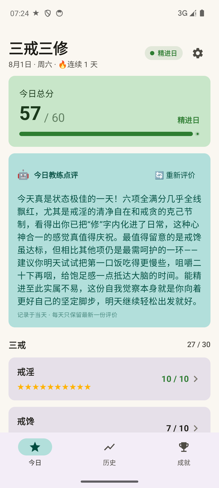
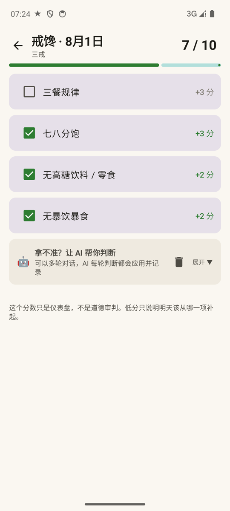
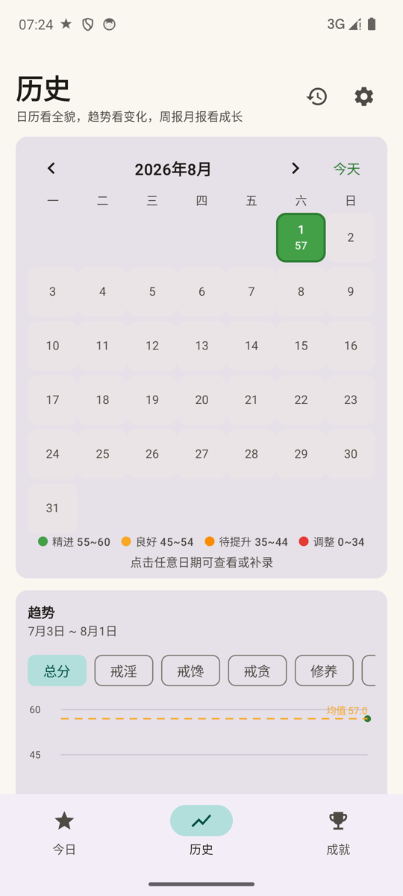
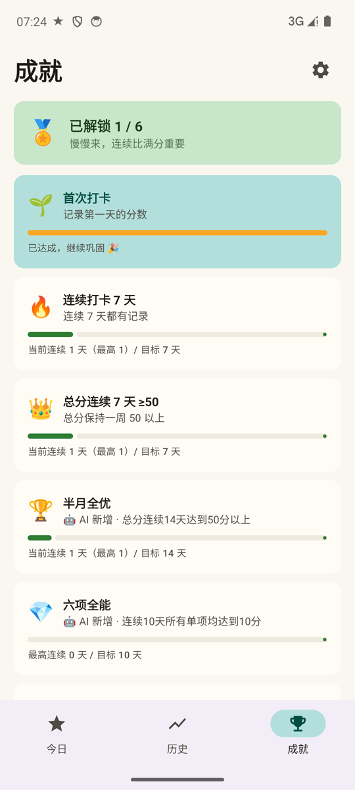
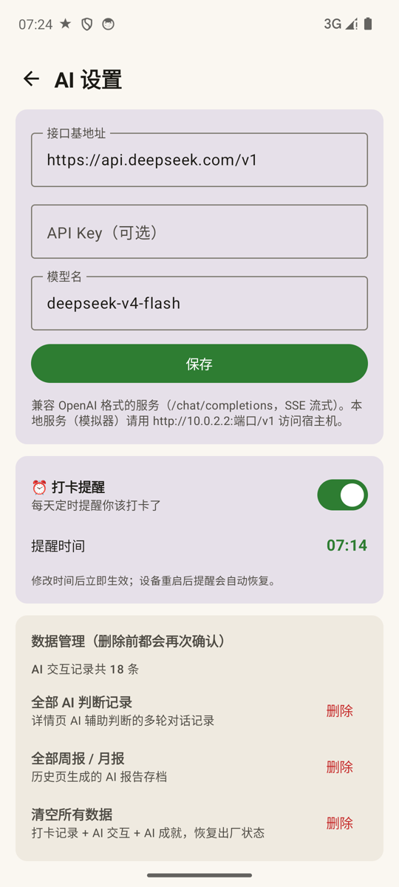

# 三戒三修 · 修身系统

> 每天 2 分钟打分的日常自评 App。**评分是仪表盘，不是审判** —— 目标不是满分，而是今天比昨天多 1 分。

Kotlin + Jetpack Compose 实现，内置 AI 教练（DeepSeek 等 OpenAI 兼容服务，SSE 流式）。

<p align="center">
  
  
  
  
  
</p>

## 📐 评分体系（满分 60）

**三戒（30 分）**
- **戒淫（10）**：单选等级 —— 10 无接触无冲动 / 8 有冲动成功克制 / 5 接触一点及时停止 / 0 完全放纵
- **戒馋（10）**：三餐规律(3) · 七八分饱(3) · 无高糖饮料零食(2) · 无暴饮暴食(2)
- **戒贪（10）**：无冲动消费(3) · 不攀比(2) · 不长时间刷无意义内容(3) · 珍惜已有资源(2)

**三修（30 分）**
- **修养（10）**：睡眠 7~9 小时(4) · 按时睡觉(3) · 起床后精神良好(3)
- **修体（10）**：力量训练(4) · 有氧运动(3) · 拉伸或步数达标(3)
- **修行（10）**：完成最重要的一件事(4) · 不拖延(2) · 创造实际价值(2) · 空想时间达标(2)

| 等级 | 分数 | 含义 |
|---|---|---|
| 🟢 精进日 | 45~60 | 状态不错，继续保持 |
| 🟡 合格日 | 30~44 | 守住了底线 |
| 🔴 调整日 | 0~29 | 明天从最弱的一项补起 |

## ✨ 核心功能

### 🏠 今日
总分卡片、等级徽章、较昨日增减、连续打卡天数、六类指标星标一览。
点「💪 打卡」后 **AI 教练结合当天数据流式生成一段短评**（重新打分后可一键重新评价）。

### ✅ 打分
纯点击勾选 / 选等级，自动算分，零文字输入。
**🤖 AI 辅助判断**：拿不准某项是否符合时，输入实际情况，AI 分两步判断
（先识别描述涉及哪些选项 → 再判断该不该勾选），自动应用并给出逐条理由。
支持多轮对话，每轮都记录（按「日期 + 条目」隔离，退出再进仍在）。

### 📅 历史（日历 + 趋势合并）
- 月历按总分上色，一眼看出整月状态；点击任意日期可查看 / 补录
- 近 30 天折线图（总分或任一单项）+ 平均 / 最高 / 达标天数
- **📅 AI 周报 / 🗓 AI 月报**：一键生成上一周期（上周一~周日 / 上月 1 号~月末）的
  AI 分析报告，流式输出；所有报告存档在独立「报告历史」页，可分栏查看、删除

### 🏅 成就
内置成就 + **AI 动态成就**：当未完成成就少于 3 个时，可请求 AI 根据你的历史表现
设计更难的新挑战。AI 只能输出受控 JSON（指标 / 达标阈值 / 周期窗口白名单），
App 端严格校验后才生效 —— **AI 添加的成就一定可以通过记录数据查询**。

### ⏰ 打卡提醒
设置页可开启每日定时提醒（精确闹钟，准点弹出），设备重启后自动恢复。

## 🤖 AI 接入

设置页（每个页面右上角 ⚙️）配置：

| 配置 | 默认值 |
|---|---|
| 接口基地址 | `https://api.deepseek.com/v1`（OpenAI 兼容，SSE 流式） |
| API Key | 用户自填（仅存本地） |
| 模型名 | `deepseek-v4-flash` |

- 所有 AI 交互（打卡短评、辅助判断、周报月报、成就生成）都记录在本地数据库，
  可在设置页查看条数并分类删除
- 无需真实大模型时可用内置 mock：`python tools/mock_llm.py`
  （模拟器访问宿主机用 `http://10.0.2.2:8080/v1`）

## 🛠 技术栈

- **Kotlin 2.0 + Jetpack Compose**（Material 3）
- **Room**（本地持久化，打卡记录 / AI 交互 / AI 成就三张表）
- **OkHttp**（SSE 流式解析，兼容 JSON null / usage 事件等边界情况）
- **AlarmManager**（精确闹钟打卡提醒 + 开机恢复）
- 导航 Compose · MVVM（单一 ViewModel + StateFlow 状态机）

## 🔨 构建

要求：JDK 17+、Android SDK（compileSdk 35）。

```bash
# 调试版
./gradlew :app:assembleDebug        # Windows: gradlew.bat

# Release 版（arm64-v8a，已签名）
./gradlew :app:assembleRelease
# 产物：app/build/outputs/apk/release/app-release.apk
```

> ⚠️ Release 签名密钥位于 `keystore/`（已 gitignore，绝不上传），
> 请自行生成并妥善保存，升级版本需使用同一密钥。
> `gradle.properties` 中配置了本地代理（127.0.0.1:10808），不需要请删除。

## 📁 项目结构

```
app/src/main/java/com/selfdiscipline/app/
├── App.kt                    # Application + 轻量依赖容器（含闹钟恢复）
├── MainActivity.kt
├── ai/                       # AI 服务：SSE 客户端、Prompt 构造、JSON 校验
├── data/                     # Room 实体、DAO、评分规则、仓库
├── logic/                    # 一句话总结、成就引擎（纯逻辑，无 UI）
├── reminder/                 # 打卡提醒（AlarmManager + Receiver）
└── ui/                       # Compose 界面（首页/打分/历史/成就/设置/报告历史）
```

## 💭 设计理念

> 评分是仪表盘，不是审判 —— 低分只说明明天该从哪里补起。

- 分数只作为参照，不当作道德评价
- 目标不是满分，而是「今天比昨天多 1 分」
- 数据全部保存在本地（Room），不上传任何内容
- AI 只提供情绪价值和辅助判断，最终决定权永远在你手里

## 🚀 后续扩展方向

体重 / 睡眠时长 / 心情 / 学习时长 / 冥想 / 消费等附加记录，
用于观察「戒淫提高了，修行是否提高」这类跨指标关联。
